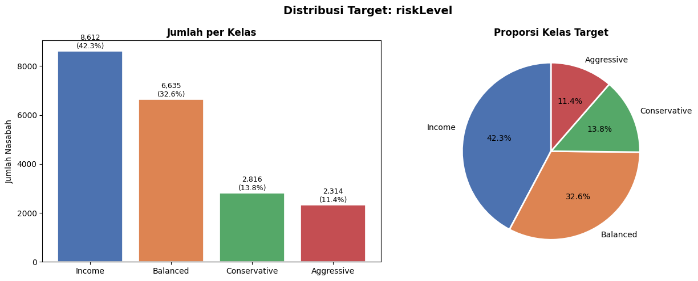
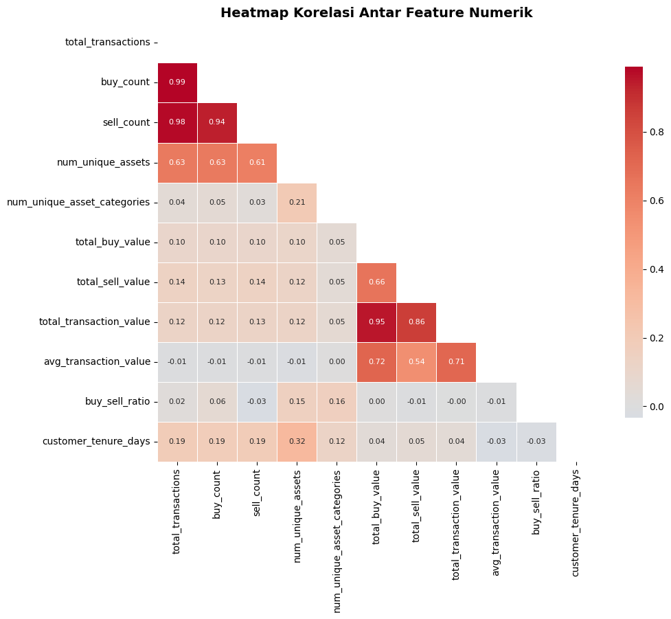
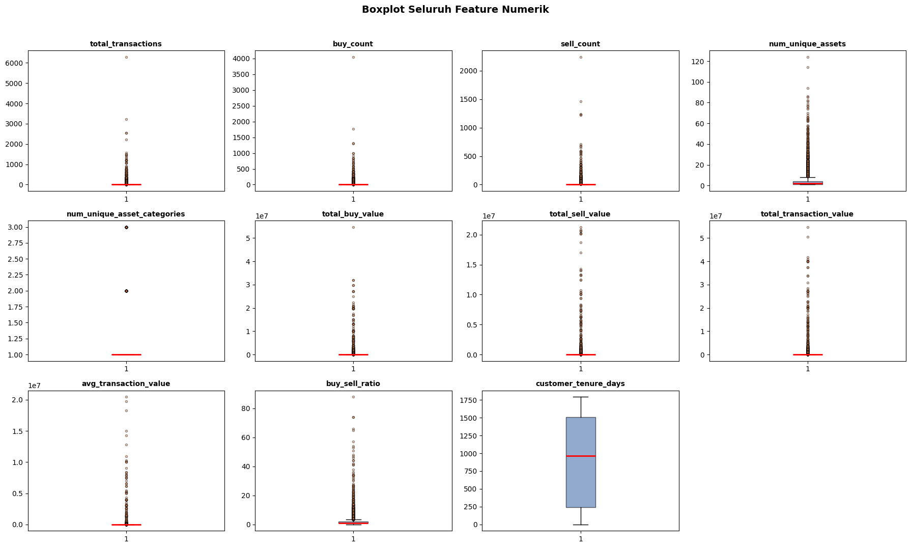
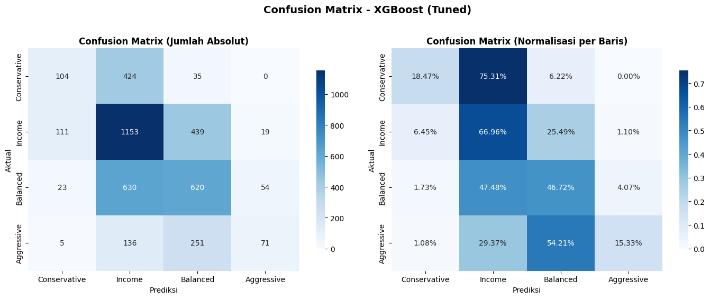

# 📊 Investor Risk Profile Classification

Machine learning system that classifies investors into four MiFID II-aligned risk profiles (**Conservative**, **Income**, **Balanced**, **Aggressive**) from transaction behavior and account data, deployed as an interactive decision-support tool for Relationship Manager and Compliance teams.

🚀 **Live demo:** https://huggingface.co/spaces/Mrabb20/risk_profile_prediction


---

## 📑 Table of Contents
- [🏦 Business Context](#-business-context)
- [🗃️ Dataset](#️-dataset)
- [🔬 Methodology](#-methodology)
- [📈 Results](#-results)
- [🗂️ Repository Structure](#️-repository-structure)
- [💻 Running Locally](#-running-locally)
- [🐳 Running with Docker](#-running-with-docker)
- [🛠️ Tech Stack](#️-tech-stack)
- [⚠️ Limitations & Next Steps](#️-limitations--next-steps)
- [👤 Author](#-author)

---

## 🏦 Business Context

Under the EU's **Markets in Financial Instruments Directive II (MiFID II)**, financial institutions are legally required to assess a client's risk profile before recommending investment products such as stocks, bonds, or mutual funds. In practice, this assessment is usually a manual questionnaire process that is slow to update as a client's actual investing behavior changes over time.

This project explores whether a client's **historical transaction behavior** (trade frequency, portfolio diversification, capital deployed, channel usage, etc.) can predict their risk profile, to serve as a **decision-support signal** that helps Relationship Managers prioritize which clients may need a profile review — it is explicitly **not** a replacement for the legally mandated MiFID II questionnaire.

## 🗃️ Dataset

- 21,629 client records, 17 raw columns, from a European financial institution's investment transaction history.
- Target: `riskLevel` (4 classes) — moderately imbalanced (Income 42.3%, Balanced 32.6%, Conservative 13.8%, Aggressive 11.4%; largest-to-smallest class ratio ≈ 3.7:1).
- After deduplication (1,252 duplicate rows removed) and feature selection, the final modeling dataset uses **10 features**: 4 categorical (`customerType`, `investmentCapacity`, `dominant_channel`, `dominant_asset_category`) and 6 numerical (`buy_count`, `num_unique_assets`, `num_unique_asset_categories`, `total_buy_value`, `buy_sell_ratio`, `customer_tenure_days`).

**Target distribution:**



## 🔬 Methodology

The full analysis lives in [`notebooks/notebook.ipynb`](notebooks/notebook.ipynb). Summary of the workflow:

1. **🔍 EDA** — outlier profiling with the IQR method, skewness/kurtosis diagnostics, correlation heatmaps, **ANOVA F-test** for numerical features vs. target, and **Chi-Square test of independence** for categorical features vs. target, to validate which features carry real statistical signal before modeling.

   | Correlation heatmap | Outlier profiling (boxplots) |
   |---|---|
   |  |  |

   The heatmap is what drove the redundancy-based feature drops in step 2 below (e.g. `total_transactions`/`buy_count`/`sell_count` sit at 0.94–0.99 correlation), and the boxplots confirm the heavy-tailed, high-outlier-percentage numerical features that justified IQR capping over deletion.

2. **⚙️ Feature Engineering** — dropped 5 mathematically redundant features identified via correlation analysis (e.g. `total_transactions` vs. `buy_count`/`sell_count`), resolved a cardinality issue in `investmentCapacity` (system-estimated `Predicted_*` values merged into their base category), applied **stratified train-test split** to preserve class ratios, and used **IQR capping (winsorization)** rather than deletion to control outliers without discarding data — important given the pipeline also benchmarks outlier-sensitive algorithms like KNN and SVM.
3. **🤖 Modeling** — benchmarked 5 algorithms (KNN, SVM, Decision Tree, Random Forest, XGBoost) with 5-fold cross-validation using `f1_macro` as the primary metric (appropriate for imbalanced multi-class problems), then tuned the strongest candidate with `RandomizedSearchCV`.
4. **✅ Evaluation** — classification report, confusion matrix analysis, and feature importance, explicitly interpreted through a business-risk lens (see below).
5. **📦 Deployment** — the trained pipeline (preprocessing + model + label encoder) is serialized with a custom `IQRCapper` transformer module (see [Limitations](#️-limitations--next-steps) for why this matters), and served through a multi-page Streamlit app.

## 📈 Results

**XGBoost (tuned)** was selected as the final model — Accuracy 47.80%, F1-Macro 38.08% on a held-out test set of 4,075 clients (vs. a 25% random-guess baseline for 4 balanced classes).

Raw accuracy alone understates what matters for this use case, so the evaluation focused on **error severity, not just error rate**:



- Nearly all misclassifications occur between **adjacent** risk classes on the risk spectrum (Conservative↔Income, Income↔Balanced, Balanced↔Aggressive).
- Misclassification between the two **extreme opposite classes** (Conservative predicted as Aggressive, or vice versa) is effectively absent (0 cases) — the exact failure mode that would be most dangerous in a real suitability-assessment context.
- Top predictive features were `investmentCapacity` and `dominant_channel`, consistent with MiFID II's emphasis on financial capacity as a core suitability criterion.

💡 In short: the model is a reasonable *first-pass triage signal* for prioritizing manual review, not a standalone compliance decision-maker — which matches its intended role.

## 🗂️ Repository Structure

```
risk_profile_prediction/
├── notebooks/
│   └── P1M2_Muhammad_Akbar_Suharbi.ipynb   # Full EDA → modeling → evaluation notebook
├── src/
│   ├── streamlit_app.py                    # App entry point / page router
│   ├── eda.py                               # EDA page
│   ├── prediction.py                        # Prediction form + inference page
│   └── custom_transformers.py               # IQRCapper transformer (pickle-safe import)
├── models/
│   └── model_xgb_tuned.pkl                  # Serialized pipeline + label encoder + feature list
├── data/
│   └── profile_investor.csv                 # Source dataset
├── docs/
│   └── *.png                                # App screenshot + EDA/result visuals
├── Dockerfile
├── requirements.txt
└── README.md
```

## 💻 Running Locally

```bash
git clone https://github.com/<your-username>/risk_profile_prediction.git
cd risk_profile_prediction

python -m venv .venv
source .venv/bin/activate        # Windows: .venv\Scripts\activate

pip install -r requirements.txt

streamlit run src/streamlit_app.py
```

The app will be available at `http://localhost:8501` 🎈

## 🐳 Running with Docker

```bash
docker build -t risk-profile-app .
docker run -p 8501:8501 risk-profile-app
```

## 🛠️ Tech Stack

**Analysis & Modeling:** Python, Pandas, NumPy, Scikit-learn, XGBoost, SciPy (Stats)
**Visualization:** Matplotlib, Seaborn, Plotly
**Deployment:** Streamlit, Docker, Hugging Face Spaces

## ⚠️ Limitations & Next Steps

- **Model performance is intentionally modest and honestly reported.** F1-Macro of 38.08% reflects a genuinely hard problem (self-reported behavioral data as a proxy for risk tolerance), not an unoptimized pipeline — 5 algorithms and hyperparameter tuning were exhausted before landing here.
- **Custom transformer pickle coupling.** Because `IQRCapper` was originally defined inside the training notebook, unpickling it outside that notebook requires registering the class into `sys.modules["__main__"]` at runtime (see `custom_transformers.py` and `prediction.py`). A cleaner long-term fix is packaging preprocessing as an installable module from the start of a project, rather than retrofitting it post-training.
- **Pickle is not XGBoost's recommended serialization format.** Loading the pipeline currently raises an XGBoost `UserWarning` recommending `Booster.save_model()` / `load_model()` (JSON/UBJSON) instead of pickle, since pickle is sensitive to XGBoost version drift across environments. The current setup works because `requirements.txt` pins compatible versions, but a more robust approach would serialize the XGBoost step separately in its native format and keep only the sklearn preprocessing in pickle.
- 🔜 Planned improvements: a **Model Performance** page (confusion matrix, per-class metrics) inside the app, prediction logging for monitoring drift, a config-driven refactor of the numeric input fields to eliminate an entire class of type-mismatch bugs, and unit tests for the feature-engineering functions.

## 👤 Author

**Muhammad Akbar Suharbi**
Data Analyst | Data Scientist | Data Engineer
[LinkedIn](https://www.linkedin.com/in/muhammad-akbar-suharbi-6955ba189/) · [GitHub](https://github.com/akbarabie)
